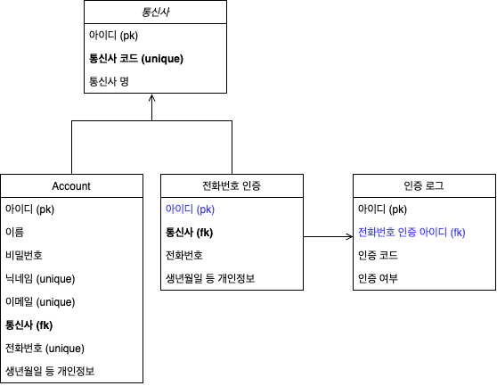

---

### 구현 목표
전화번호 인증 후에 회원 가입 및 비밀번호 재설정이 가능한 API 제작  


---
#### 구현 기능
- 사용자는 다음과 같은 정보를 가진다.  
( 사용자 명, 닉네임, 이메일, 비밀번호, 통신사, 휴대폰 번호, 생년월일, 성별 )

- 전화 번호 인증 기능

- 회원 가입 기능

- 비밀번호 재설정 기능

- 로그인 기능

- 내 정보 보기 기능

---
#### 사용기술 및 구현스펙
- docker (v 20.10.17)
- python (v 3.9.7)
- postgres (v 14.1)

---
#### 실행 방법
1. docker 설치

2. 프로젝트 루트 디렉토리에서 다음 커맨드 실행
```shell
docker-compose up -d
```
API 테스트 및 명세: [API 명세서( Swagger )](http://localhost:8000/swagger/)

데이터 관리: [관리 페이지](http://localhost:8000/admin/)  
(id: admin, password: admin1234)

---
#### 실행 예시
- [전화번호 인증]
  * 매칭할 데이터는 [관리 페이지](http://localhost:8000/admin/) Phone certifications 확인  
  1. 통신사 조회 API 실행, 사용할 통신사에 해당하는 코드 확인
  2. 휴대폰 인증 API 실행, 결과 데이터(인증 로그 아이디) 저장
  * (예시 request parameter)
      > { "user_name": "홍길동1", "mobile_carrier_code": "1111", "phone_number": "01011111111", "date_of_birth": "2022-08-30", "gender": "M" }
  3. [관리 페이지](http://localhost:8000/admin/) Phone certifigcation logs 확인
  4. 2에서 받은 코드에 대한 인증 로그 데이터 확인
  5. 인증 코드 체크 API 실행, 결과 데이터 저장
      > { "log_id": (2의 response data), "code": (4에서 확인한 인증 코드) }

- [회원가입]
  1. 전화번호 인증
  2. 회원가입 API 실행
  * (예시 request parameter)
  > { "log_id": (1의 response data), "name": "홍길동1", "nick_name": "홍길동1_닉네임", "email": "ghdrlfehd1@test.com", "password": "test12341234", "mobile_carrier_code": "1111", "phone_number": "01011111111", "date_of_birth": "2022-08-30", "gender": "M" }

- [비밀번호 재설정]
  1. 전화번호 인증
  2. 비밀번호 변경 API 실행,  
  * (예시 request parameter)
  > { "log_id": (1의 response data), "phone_number": "01011111111", "new_password": "test123123" }

- [로그인]
  1. 로그인 API 실행, 결과 access_token 저장
  * (예시 request parameter)
  > { "id": "ghdrlfehd1@test.com" or 01011111111, "password": "test12341234" }

- [내 정보 보기]
  1. 로그인
  2. 상단의 Authorize 버튼 클릭
  3. 출력되는 팝업의 value에 1에서 받은 access_token 값 입력
     (Header의 Authorization에 값을 넣어주는 행위)
  4. response 결과 확인

---
#### 설계 의도
- docker, swagger 등 환경 설정
  
- 사용자 스토리 기반으로 API 설계
  - 전화번호 인증: 통신사 조회 API -> 휴대폰 인증 API -> 인증 코드 체크 API
  - 회원가입: 전화번호 인증 -> 회원가입 API
  - 비밀번호 변경: 전화번호 인증 -> 비밀번호 변경 API
  - 로그인: 로그인 API
  - 내 정보 보기: 로그인 -> 유저 정보 조회 API
```
 > 상세
[ 전화번호 인증 설계 ]
 1. 개인정보 입력 및 인증 버튼 클릭  
 2. 인증코드 발급
    a. 올바른 개인정보인지 체크 (휴대폰 인증 테이블과 데이터 매칭)
    b. 인증코드 생성 (인증 로그 테이블에 적재)
 3. 인증코드 입력
    a. 인증 만료 체크 (5분)
    b. 유효한 인증코드인지 검증
    c. 유효할 경우 해당 로그 인증 여부 체크
 4. 인증 여부를 체크하여 인증이 완료된 경우에 다음 액션(회원가입 및 비밀번호 재등록) 허용
```

- 데이터베이스 설계  


- 프론트엔드에서 실제로 필요한 데이터로만 response를 설계
  - 로그인 시 생성되는 jwt 토큰으로 계정 정보 접근
  - 전화번호 인증에 대해 프론트엔드에서는 인증 로그 아이디만 보유

